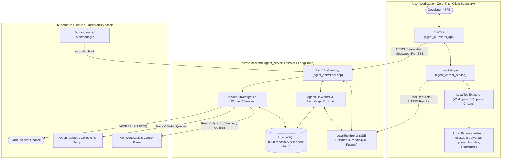
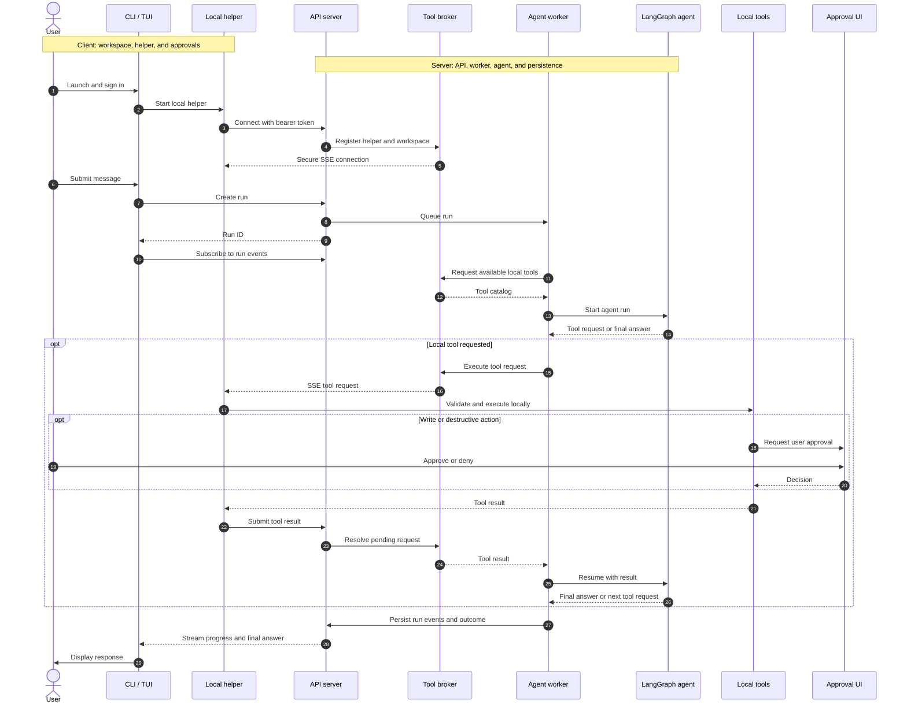
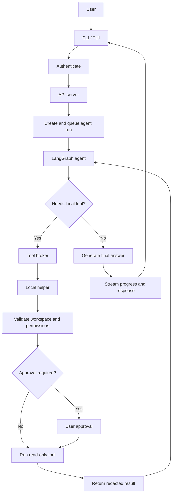
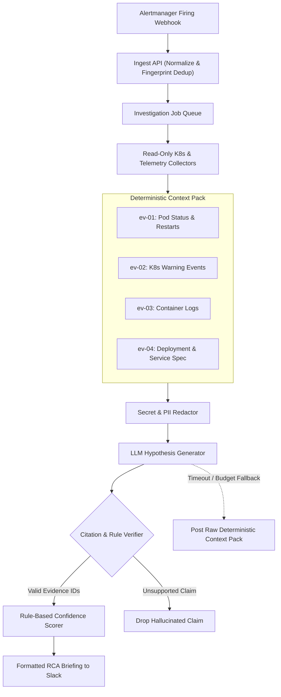

```mermaid
flowchart TB
    subgraph ClientSide["User Workstation (Zero-Trust Client Boundary)"]
        User([Developer / SRE]) <--> CLI["CLI/TUI (agent_cli.textual_app)"]
        CLI <--> Helper["Local Helper (agent_cli.tool_service)"]
        Helper --> Executor["LocalToolExecutor (Workspace & Approval Checks)"]
        Executor --> LocalTools["Local Binaries: kubectl, docker, git, aws, az, gcloud, list_files, grep/ripgrep"]
    end


    subgraph ControlPlane["Private Backend (agent_server: FastAPI + LangGraph)"]
        API["FastAPI Gateway (agent_server.api.app)"]
        Broker["LocalToolBroker (SSE Dispatch & PendingCall Futures)"]
        Worker["AgentRunWorker & LangGraphRuntime"]
        IncWorker["Incident Investigation Worker & Verifier"]
        DB[("PostgreSQL (RunRepository & Incident Store)")]
        
        API <--> Broker
        API <--> Worker
        API --> IncWorker
        Worker <--> Broker
        Worker <--> DB
        IncWorker <--> DB
    end


    subgraph ClusterEnv["Kubernetes Cluster & Observability Stack"]
        K8s["K8s Workloads & Control Plane"]
        Prom["Prometheus & Alertmanager"]
        OTel["OpenTelemetry Collector & Tempo"]
        Slack(["Slack Incident Channel"])
    end


    CLI <-->|"HTTPS: Bearer Auth, Messages, Run SSE"| API
    Helper <-->|"SSE Tool Requests / HTTPS Results"| Broker
    Prom -->|"Alert Webhook"| API
    IncWorker -->|"Read-Only K8s / Telemetry Queries"| K8s
    IncWorker -->|"Trace & Metric Queries"| OTel
    IncWorker -->|"Verified RCA Briefing"| Slack
```

```mermaid
sequenceDiagram
    autonumber

    actor User
    participant CLI as CLI / TUI
    participant Helper as Local helper
    participant API as API server
    participant Broker as Tool broker
    participant Worker as Agent worker
    participant Agent as LangGraph agent
    participant Local as Local tools
    participant Approval as Approval UI

    Note over User,Helper: Client: workspace, helper, and approvals
    Note over API,Agent: Server: API, worker, agent, and persistence

    User->>CLI: Launch and sign in
    CLI->>Helper: Start local helper
    Helper->>API: Connect with bearer token
    API->>Broker: Register helper and workspace
    Broker-->>Helper: Secure SSE connection

    User->>CLI: Submit message
    CLI->>API: Create run
    API->>Worker: Queue run
    API-->>CLI: Run ID
    CLI->>API: Subscribe to run events

    Worker->>Broker: Request available local tools
    Broker-->>Worker: Tool catalog
    Worker->>Agent: Start agent run
    Agent-->>Worker: Tool request or final answer

    opt Local tool requested
        Worker->>Broker: Execute tool request
        Broker-->>Helper: SSE tool request
        Helper->>Local: Validate and execute locally
        opt Write or destructive action
            Local->>Approval: Request user approval
            User->>Approval: Approve or deny
            Approval-->>Local: Decision
        end
        Local-->>Helper: Tool result
        Helper->>API: Submit tool result
        API->>Broker: Resolve pending request
        Broker-->>Worker: Tool result
        Worker->>Agent: Resume with result
        Agent-->>Worker: Final answer or next tool request
    end

    Worker->>API: Persist run events and outcome
    API-->>CLI: Stream progress and final answer
    CLI->>User: Display response
```

```mermaid
flowchart TD
    User["User"] --> CLI["CLI / TUI"]
    CLI --> Login["Authenticate"]
    Login --> API["API server"]
    API --> Run["Create and queue agent run"]
    Run --> Agent["LangGraph agent"]
    Agent --> Decision{"Needs local tool?"}
    Decision -- "No" --> Answer["Generate final answer"]
    Decision -- "Yes" --> Broker["Tool broker"]
    Broker --> Helper["Local helper"]
    Helper --> Check["Validate workspace and permissions"]
    Check --> Approval{"Approval required?"}
    Approval -- "No" --> Execute["Run read-only tool"]
    Approval -- "Yes" --> UserApproval["User approval"]
    UserApproval --> Execute
    Execute --> Result["Return redacted result"]
    Result --> Agent
    Answer --> Stream["Stream progress and response"]
    Stream --> CLI
```

```mermaid
flowchart TD
    Alert["Alertmanager Firing Webhook"] --> Ingest["Ingest API (Normalize & Fingerprint Dedup)"]
    Ingest --> Queue["Investigation Job Queue"]
    Queue --> Collector["Read-Only K8s & Telemetry Collectors"]
    
    subgraph EvidencePack["Deterministic Context Pack"]
        E1["ev-01: Pod Status & Restarts"]
        E2["ev-02: K8s Warning Events"]
        E3["ev-03: Container Logs"]
        E4["ev-04: Deployment & Service Spec"]
    end
    
    Collector --> EvidencePack
    EvidencePack --> Redact["Secret & PII Redactor"]
    Redact --> LLM["LLM Hypothesis Generator"]
    LLM --> Verifier{"Citation & Rule Verifier"}
    
    Verifier -->|"Valid Evidence IDs"| Score["Rule-Based Confidence Scorer"]
    Verifier -->|"Unsupported Claim"| Drop["Drop Hallucinated Claim"]
    Score --> Slack["Formatted RCA Briefing to Slack"]
    LLM -.->|"Timeout / Budget Fallback"| Fallback["Post Raw Deterministic Context Pack"]
```
